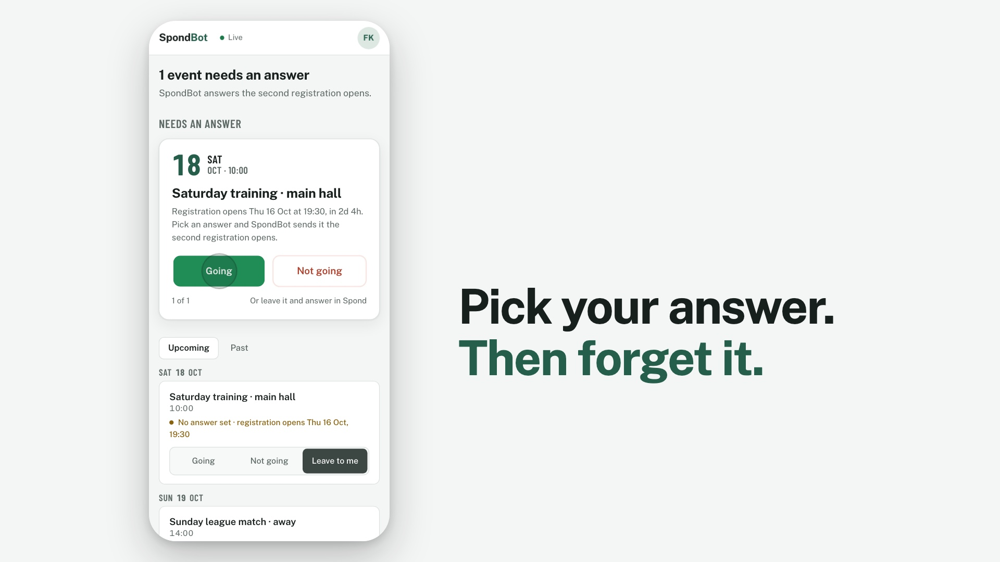

# ⚡ SpondBot — Auto-Accept RSVP & Multi-User Dashboard

<div align="center">

[](LICENSE)
[](https://github.com/kargfel/spond-bot/stargazers)
[](https://github.com/kargfel/spond-bot/network/members)
[](https://github.com/kargfel/spond-bot/issues)
[](#)
[](#)
[](#)

*An automated, self-hosted Bot & Dashboard for the Spond app.*
</div>

---

## 🌟 Overview

Tired of missing out on high-demand group events because they fill up in seconds? **SpondBot** connects to your Spond account and sends your answer (Going or Not going) the moment registration opens, to the millisecond. You pick the answer in advance; the bot handles the timing.



Originally a simple cron-script, SpondBot is now a fully-fledged platform featuring:
- **👮 Multi-User Support**: Host your own instance and let multiple users configure their own RSVP settings.
- **🎨 Web Dashboard**: Members answer undecided events from an inbox and see every event by day, on phone or desktop. Admins get a live console with the answer queue, a per-account timeline, an audit trail and timing charts.
- **📱 Installable App**: Add SpondBot to the home screen like a native app. It shows a friendly offline page when the server can't be reached, and can send a notification whenever an answer went out (or failed).
- **⚡ Background Automation**: Fully containerized schedule-driven worker that strictly adheres to your configured limits.
- **🔒 Secure & Private**: Hosted entirely on your own hardware. Your Spond credentials are systematically encrypted.

---

## ✨ Key Features


- **Phone & Email Authentication**: Automatically detects whether an account uses an email or phone number.
- **Zero-Trust Hardened**: All stored credentials are encrypted with a Fernet symmetric key.
- **Admin Management Portal**: Invite members with single-use links (they connect their own Spond account, so you never handle their passwords), manage logins, and watch timing and failures.
- **Audit Trail**: Every sign-in (also failed ones), change, refusal and every answer the bot sent is recorded with who, what, when and from where. Filter it in the admin panel and export it as CSV. Entries are deleted after 90 days by default.
- **Push Notifications** *(optional)*: Members get a notification on their phone or desktop when SpondBot sent their answer or failed to, and a reminder 8, 4 and 1 hours before registration opens for an event they haven't decided yet. Each member picks which of these they want.
- **Hardened by default**: Sessions are re-checked on every request (demoting a user or changing a password takes effect immediately), strict Content-Security-Policy and security headers, rate-limited sign-in, encrypted credentials. See [docs/security.md](docs/security.md).
- **Operations built in**: Container health checks (`/api/v1/health`) and nightly database backups with retention.
- **Automated Deployments**: Quick-start configured with Docker & `docker-compose`.

---

## 🚀 Quick Setup & Deployment

SpondBot is incredibly easy to deploy using Docker. You can host this on your local PC, a Raspberry Pi, or a VPS server.

### 1. Prerequisites
- **[Docker & Docker Compose](https://docs.docker.com/get-docker/)** installed on your machine.
- Git (optional, but recommended).

### 2. Download and Configure
Clone this repository (or download it as a ZIP):
```bash
git clone https://github.com/kargfel/spond-bot.git
cd spond-bot
```

Create your environment configuration:
```bash
cp .env.example .env
```

Open `.env` in your favorite text editor to configure the secrets:
- **`DB_PASSWORD`**: Set a strong database password.
- **`FERNET_KEY`**: Generate this securely (run `python3 -c "from cryptography.fernet import Fernet; print(Fernet.generate_key().decode())"`).
- **`API_KEY`**: Set a strong random token.
- **`ADMIN_PASSWORD`**: Set your initial administrator password to access the Web UI (at least 10 characters; SpondBot refuses to create the admin with an example password like `changeme`).

Optional, but worth knowing before you go live:
- **`TRUSTED_PROXIES`**: If SpondBot runs behind a reverse proxy, set this to the proxy's IP (see [Advanced Deployment](DEPLOY.md)). Otherwise every visitor looks like the proxy in the audit trail and shares one sign-in rate limit.
- **`VAPID_PRIVATE_KEY`**: Enables push notifications. Generate it after the first start with `docker compose exec app python scripts/generate_vapid_key.py` and add the printed line to `.env`.
- **`AUDIT_RETENTION_DAYS`**: How long the audit trail is kept (default `90`). IP addresses are personal data, so keep it short.

### 3. Start SpondBot!
```bash
docker compose up -d --build
```
*That's it!* SpondBot is now running in the background.

### 4. Access the Dashboard
Open your web browser and navigate to:
👉 **`http://localhost:8080`** *(or your server's IP address)*

Log in with:
- **Username**: `admin`
- **Password**: *(What you set for `ADMIN_PASSWORD`)*

From there, open **My events** to connect your own Spond account, and invite members from **Users → Invite member**. See [docs/setup.md](docs/setup.md) for backups, health checks and every setting.

> **HTTPS:** Installing the app on a phone and push notifications only work over HTTPS (or on `localhost`). Put SpondBot behind a TLS-terminating reverse proxy and set `SITE_DOMAIN` to your domain.

### 5. Install the app and turn on notifications *(optional)*
Members open the account menu in the dashboard:
- **Install app** adds SpondBot to the home screen (on iPhone/iPad: Share → *Add to Home Screen*; notifications on iOS only work from the installed app).
- **Notifications** turns on push messages for that device, lets you choose which ones you get (answers sent or failed, reminders 8/4/1 hours before registration opens) and can send a test message. This item only appears once `VAPID_PRIVATE_KEY` is set.

---

## 📖 Documentation

| Guide | What's in it |
|---|---|
| **[Advanced Deployment Guide](DEPLOY.md)** | Exposing SpondBot to the internet behind a reverse proxy like Traefik on a dedicated JumpHost |
| [docs/setup.md](docs/setup.md) | Every setting, backups and restore, the audit trail, push notifications, `TRUSTED_PROXIES` |
| [docs/security.md](docs/security.md) | What protects SpondBot, what you must set up yourself, and known limits |
| [docs/architecture.md](docs/architecture.md) | Components, data model and API routes |
| [docs/feature-ideas.md](docs/feature-ideas.md) | Backlog and design sketches |

---

## 🤝 Contributing & Support

If you run into issues, have feature requests, or want to contribute:
1. Open an Issue in the [Issue Tracker](https://github.com/kargfel/spond-bot/issues).
2. Fork the repository and open a Pull Request.

---

## 📝 License

This project is generously provided under the [MIT Open Source License](LICENSE).
